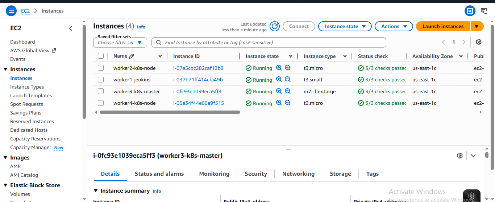
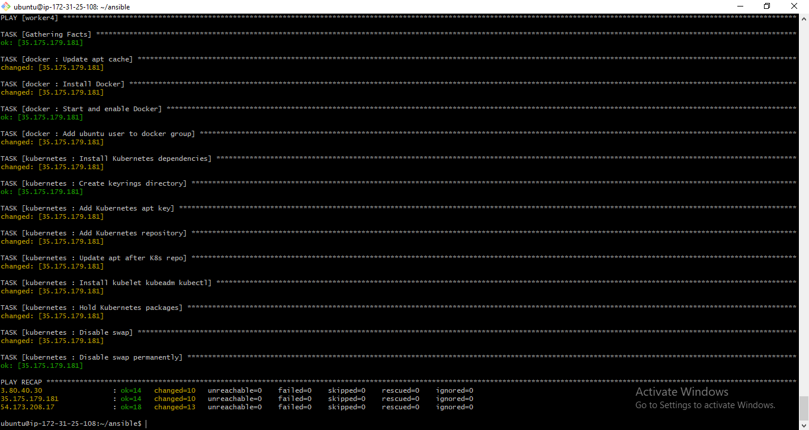
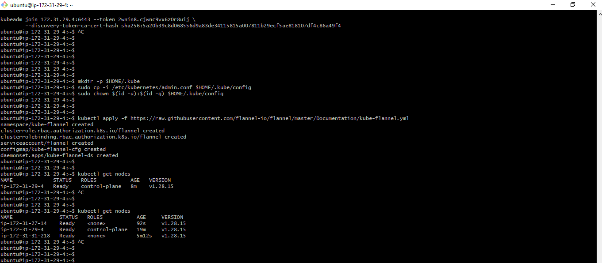
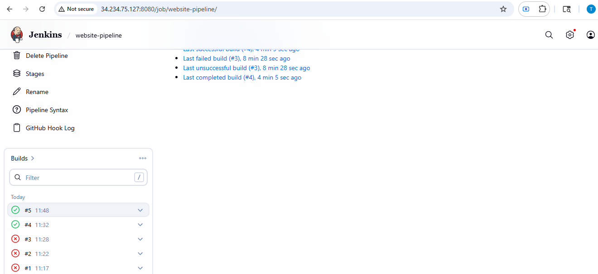
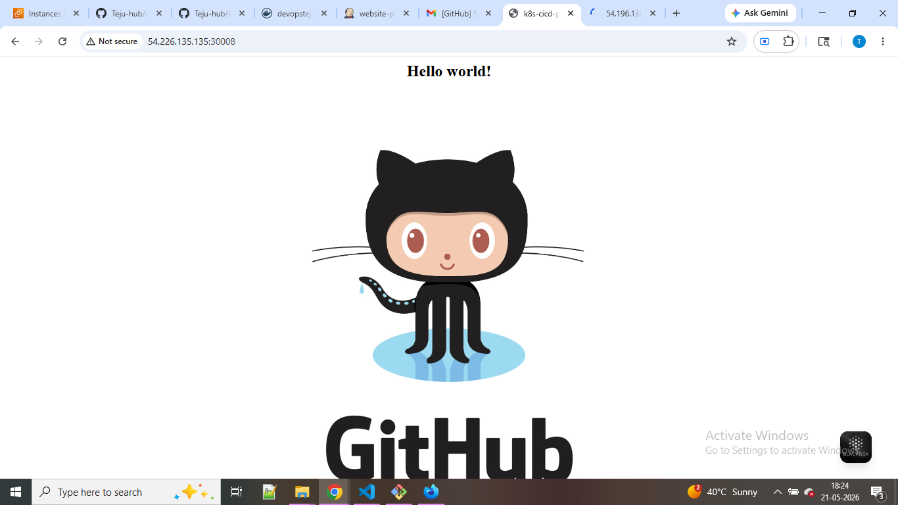
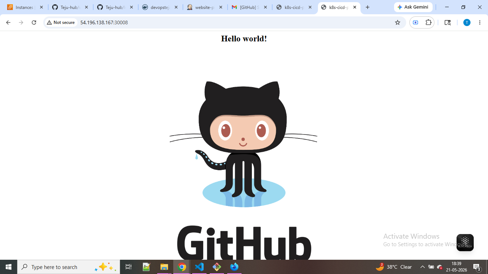

# Kubernetes CI/CD Pipeline on AWS

Automated DevOps pipeline that builds, containerizes, and deploys a web application 
to a Kubernetes cluster on AWS using Jenkins, Docker, Ansible, and Terraform.

## Architecture

```
Developer → GitHub → Jenkins → DockerHub → Kubernetes Cluster
├── Worker2 (pod)
└── Worker4 (pod)
```

## Infrastructure (4 EC2 instances)

| Machine | Role | Software |
|---|---|---|
| Worker1 | Jenkins Controller | Jenkins, Java |
| Worker2 | Kubernetes Worker | Docker, Kubernetes |
| Worker3 | Kubernetes Master | Java, Docker, Kubernetes |
| Worker4 | Kubernetes Worker | Docker, Kubernetes |

## Pipeline Flow

1. Developer pushes code to GitHub
2. GitHub webhook triggers Jenkins automatically
3. Jenkins clones the repository
4. Jenkins builds a Docker image from the Dockerfile
5. Docker image is pushed to DockerHub
6. Jenkins SSHes into Kubernetes master
7. Kubernetes pulls image from DockerHub and deploys with 2 replicas
8. App is accessible via NodePort on port 30008

## Tech Stack

- **Infrastructure**: Terraform (AWS EC2)
- **Configuration Management**: Ansible (Roles)
- **CI/CD**: Jenkins Pipeline
- **Containerization**: Docker
- **Orchestration**: Kubernetes (kubeadm)
- **Version Control**: Git/GitHub
- **Registry**: DockerHub

## Project Structure

```
k8s-cicd-pipeline-aws/
├── terraform/
│   └── main.tf              # AWS infrastructure
├── ansible/
│   ├── inventory.ini        # Server IPs
│   ├── site.yml             # Master playbook
│   └── roles/
│       ├── jenkins/         # Jenkins + Java install
│       ├── docker/          # Docker install
│       ├── kubernetes/      # K8s install
│       └── java/            # Java install
├── kubernetes/
│   ├── deployment.yaml      # 2 replicas deployment
│   └── service.yaml         # NodePort on 30008
├── Dockerfile               # in website repo(App containerization)
└── Jenkinsfile              # Pipeline definition
```

> **Note:** Dockerfile is maintained in the application repository:
> [github.com/Teju-hub/website](https://github.com/Teju-hub/website)

## How to Run

### 1. Infrastructure
```bash
cd terraform
terraform init
terraform apply
```

### 2. Configuration
```bash
cd ansible
ansible-playbook -i inventory.ini site.yml
```

### 3. Kubernetes Cluster
```bash
# On Worker3 (master)
kubeadm init --pod-network-cidr=10.244.0.0/16
kubectl apply -f https://raw.githubusercontent.com/flannel-io/flannel/master/Documentation/kube-flannel.yml

# On Worker2 and Worker4
kubeadm join <master-ip>:6443 --token <token> --discovery-token-ca-cert-hash <hash>
```

### 4. Jenkins
- Access Jenkins at `http://<worker1-ip>:8080`
- Add DockerHub credentials with ID `dockerhub-credentials`
- Add Worker3 SSH key with ID `k8s-master-ssh`
- Create Pipeline job pointing to this repo's Jenkinsfile

### 5. Access the App
`http://<worker2-ip>:30008`
`http://<worker4-ip>:30008`

## Git Workflow

- `dev` branch — active development
- `master` branch — production releases only
- Releases happen on the 25th of every month
- Jenkins pipeline triggers automatically on master push
- Scheduled release: cron trigger on 25th of every month

## Important Notes

- kubeadm join token expires after 24 hours — regenerate with:
  `kubeadm token create --print-join-command` on Worker3
- Run `terraform destroy` after use to avoid AWS charges

## Screenshots

### Terraform Infrastructure


### Ansible Configuration


### Kubernetes Cluster


### Jenkins Pipeline


### Running Application



